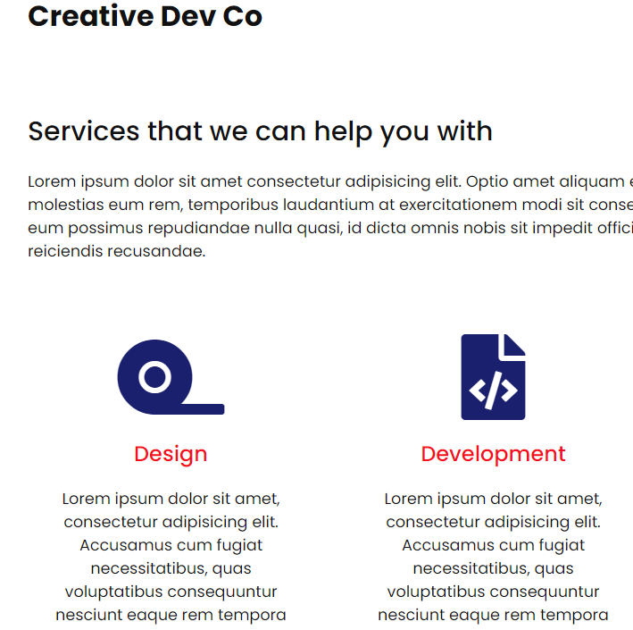
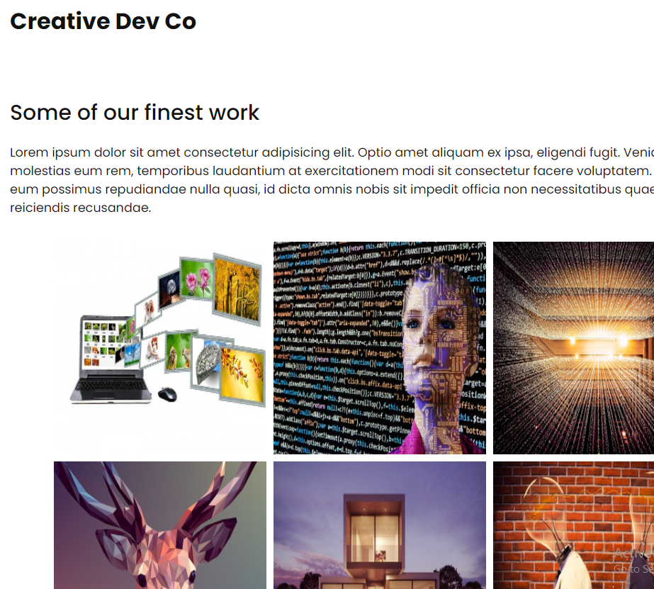

Four Page Website for a Creative Company
----------------------------------------
- Vanilla javascript, html and css included for elements in this client project.
- Styling with css using flexbox, root colors, hovers, transforms, active tabs, nav/social,
 z-indexes, displays, icons, images.
- Buttons and contact form also styled with css

- Landing page features a 'Get Started' and hamburger button to entice the reader to click through and discover the business.

- Second page lists businesses services.
- Page 3 has businesses portfolio which can be extended further to outside sites etc.
- Page 4 is a contact form and address, phone, email details.

- Media adaptability has been included and each page of the site is optimized to work on desktop, tablet or mobile devices.

- A site that is easy to change up for different clients with images and content.

Sample of some of the content is below
-------------------------------

***

***

***

 